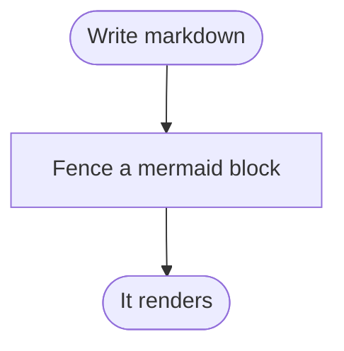

Fence a block with `mermaid` and it renders on load, light and dark aware, with no per-post
front matter:

```mermaid
flowchart TB
  A(["Write markdown"]) --> B["Fence a mermaid block"]
  B --> C(["It renders"])
```

The renderer loads from a CDN at view time, so the build stays plain Jekyll.
